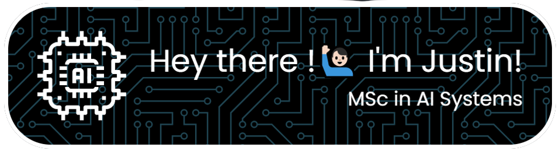

I work in the Electronics Engineering department at the Civil Aviation Authority of Qatar, specializing in AI and IT. I am passionate about data, machine learning, natural language processing, and computer vision, with a strong appreciation for both technology and human intelligence.

  

  

### 🔭 I'm currently working on personal projects (some shared publicly here in github) alongside the private projects of my role at the Civil Aviation Authority of Qatar (QCAA).

## 🌟 Key Highlights of My Background

- Graduated MSc in AI Systems [@EPITA PARIS](https://www.epita.fr/) with a BSc in Computer Science.
- Passionate about applying AI and various IT solutions to real-world challenges, particularly in aviation and public safety.
- I am **24** years old.

## 🌱 Some of the most important courses of my MSc in AI

- Operations Research: Linear programming & Optimization for Data Science
- Numerical & Advanced Algorithms
- Natural Language Processing
- AI in Signal & Audio Processing
- AI in Image and Video Processing
- Reinforcement Learning
- Data Science in Production
- Knowledge representation and AI History
- Cloud computing platforms for AI (AWS)

## 🤖 Fun fact

My passion for AI and technology was built through my love for video games. I was always fascinated by how intelligent the non-player characters seemed, and eventually learned that their behavior was being controlled by AI algorithms. I was also continually astounded by how machine learning could anticipate the progression of cancer, and eventually discovered that this remarkable predictive power was driven by AI algorithms.

## 🗝️ Skills

<h3 align="left">Languages and Tools:</h3>

                                

&nbsp;

Thanks for stopping by, feel free to explore my repositories (that I am posting/making public very soon) and get in touch!
