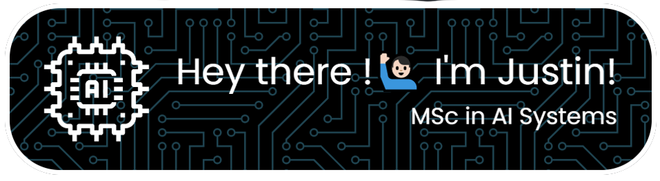

I'm an AI systems [@EPITA PARIS](https://www.epita.fr/) MSc student with a passion for machine learning, natural language processing, and computer vision. I love exploring new AI techniques and applying them to solve real-world problems. 

<!---
## 🔭 I'm currently working on

- Nothing for now!
-->

## 🌱 I'm currently learning

- (put the courses im taking rn).
- Cloud computing platforms for AI (AWS).

## 📫 How to reach me

- [LinkedIn](https://www.linkedin.com/in/justin-amine/)
- Email: justinamine24@outlook.com

## 🤖 Fun fact

My passion for AI was built through my love for video games. I was always fascinated by how intelligent the non-player characters seemed, and eventually learned that their behavior was being controlled by AI algorithms.

## 📊 GitHub Stats

I haven't posted on github too much yet, but things are coming!
 
[]

## Skills

Thanks for stopping by, feel free to explore my repositories and get in touch!
